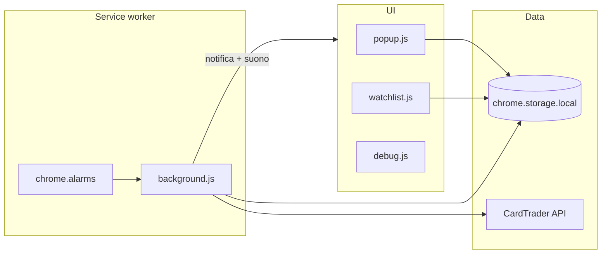

# Crometium TCG — Come funziona

Guida tecnica per capire il flusso dell’estensione (v0.8).

## Panoramica

## Ciclo di polling

1. All’installazione / startup: `migrateStorage()` + `ensureAlarm()`.
2. L’alarm `sniperLoop` scatta ogni `pollMinutes` (Free fisso 20; Pro 3–5).
3. `avviaControlloLista()` legge `watchList` + `token`.
4. Per ogni blueprint: `GET /api/v2/marketplace/products?blueprint_id=...`.
5. Split offerte → miglior **Zero** e miglior **Normale**.
6. Aggiorna `lastSeen*` sulla voce e scrive un campione in `priceHistory`.
7. Se prezzo ≤ `target` sul canale abilitato → notifica (dedupe per product/canale).
8. Se `autoCart` → `POST /api/v2/cart/add` e archivia in `cartArchive`.

## Canali Zero / Normale

| Canale | Cosa cerca | Flag voce |
|---|---|---|
| CT Zero | Listing inviabili con CardTrader Zero | `watchZero` |
| Normale | Spedizione diretta venditore | `watchNormal` |

Rilevamento Zero (come in Mobile Price Suit): `can_be_sent_with_zero` oppure `user.can_sell_sealed_with_ct_zero`.

## Storico e grafici

Ogni check aggiunge `{ t, z, n }` in `priceHistory[blueprintId]`.

- Prune: max ~32 giorni, max 2500 punti (ultimi ~720 a densità piena).
- UI: canvas in popup e watchlist.
- Intervalli: giorno / settimana / mese.
- **Hover**: tooltip vicino al cursore con ora + prezzi Zero/Normale del campione più vicino; linea verticale e punti evidenziati.

## Alert e suono

- Notifica Chrome con icona e titolo localizzato.
- Suono `sound_campanella` via **offscreen document** (MV3 non può suonare direttamente dal service worker).
- Toggle `alertSound` (default attivo).

## Storage (`chrome.storage.local`)

| Chiave | Ruolo |
|---|---|
| `token` | Bearer API |
| `watchList` | Lista carte monitorate |
| `priceHistory` | Serie temporali per grafici |
| `pollMinutes` / `nextTick` | Intervallo e countdown |
| `locale` | `it` \| `en` \| `es` |
| `alertSound` | Suono on/off (effetto solo in Pro) |
| `installAt` | Prima installazione (trial 30 giorni) |
| `entitlement` / `licenseKey` | Cache e chiave Pro |
| `cartArchive` / `cartAddress` | Auto-cart |
| `debugMode` / `debugLogs` | Debug API (Pro) |
| `lastStatus` | Esito ultimo ciclo |

## UI

| Superficie | File | Ruolo |
|---|---|---|
| Popup | `popup.html` / `popup.js` | Lista, aggiungi carta, settings, grafico, archivio |
| Watchlist | `watchlist.html` / `watchlist.js` | Griglia ricercabile/filtrabile + grafici |
| Debug | `debug.html` / `debug.js` | Log request/response |
| Offscreen | `offscreen.html` / `offscreen.js` | Playback audio |

## Permessi MV3

`storage`, `alarms`, `notifications`, `offscreen`, `activeTab`, `scripting`  
Host: `api.cardtrader.com`, `www.cardtrader.com`.

## Sicurezza

- Non committare token reali.
- Auto-cart scrive sul carrello CardTrader: usalo consapevolmente.
- Il checkout **non** viene completato automaticamente.
