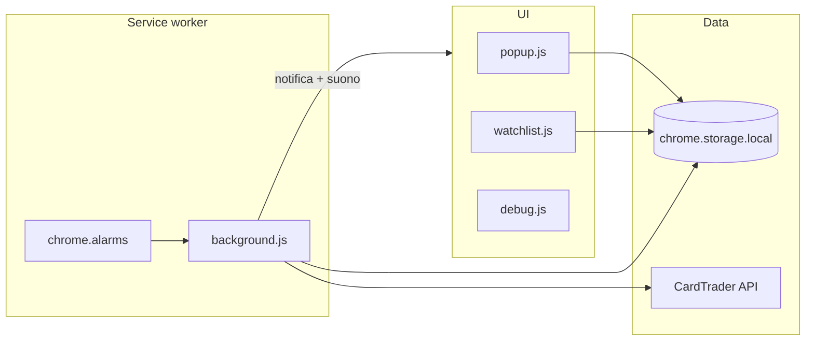
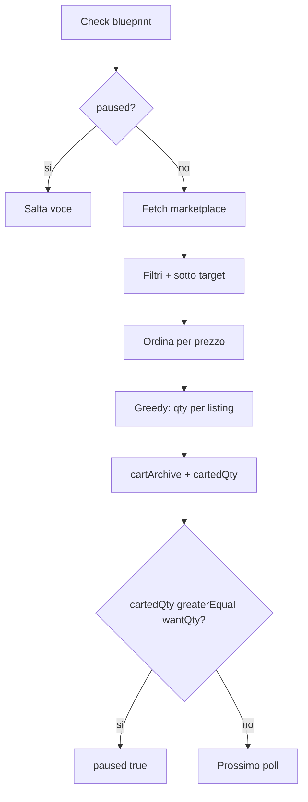

# Crometium TCG — Come funziona

Guida tecnica per capire il flusso dell’estensione (v0.8).

## Panoramica

## Import lista mazzo

Pannello **Importa lista mazzo**: all’apertura il popup si allarga (max 800×600) e la textarea occupa lo spazio restante.

1. Parse `Nx CODICE` in [`deckImport.js`](../deckImport.js).
2. Messaggio `importDeckList`: catalogo CT + marketplace → `target = min * (1 - percent/100)`.
3. `wantQty` dalla riga; canali/filtri dal form Aggiungi carta.
4. **Max** in lista è un input editabile (`item.target`).

## Ciclo di polling

1. All’installazione / startup: `migrateStorage()` + `ensureAlarm()`.
2. L’alarm `sniperLoop` scatta ogni `pollMinutes` (Free fisso 20; Pro 3–5).
3. `avviaControlloLista()` legge `watchList` + `token`.
4. Per ogni voce **non** in `paused`: `GET /api/v2/marketplace/products?blueprint_id=…` (opz. `language`, `foil`).
5. Filtra listing (carta singola, lingua, condizione, finish) → miglior **Zero** e miglior **Normale** (prezzi UI).
6. Aggiorna `lastSeen*` / `min*` e scrive un campione in `priceHistory`.
7. Se prezzo ≤ `target` sul canale abilitato → notifica aggregata (dedupe per product/canale).
8. Se `autoCart` (Pro) → fill greedy fino a `wantQty`, aggiorna `cartArchive` / `cartedQty`; a obiettivo raggiunto → `paused: true`.

## Filtri listing

Modello e matching in [`watchItem.js`](../watchItem.js). Array vuoto = nessun filtro (tutte le offerte).

| Filtro | Campo voce | API marketplace | Matching client |
|---|---|---|---|
| Lingua | `languages[]` | `language=` se una sola lingua a 2 lettere | `*_language` / `language` in `properties_hash` |
| Condizione | `conditions[]` | — | `properties_hash.condition` |
| Finish | `foilModes[]` (`foil` / `nonfoil` / `reverse`) | `foil=true\|false` se solo foil o solo nonfoil | `*_foil` / `foil`; reverse: `pokemon_reverse` / `reverse` |

Note:

- Finish è **multi-gioco**: qualsiasi chiave `*_foil` (es. `mtg_foil`, `fab_foil`) conta come foil.
- Su Pokémon (e alcuni TCG) reverse/holo speciali sono spesso **blueprint diversi**: il filtro agisce solo sulle offerte di quel blueprint.
- Cambiare lingua / condizione / finish su una voce già in lista **resetta** i prezzi visti (`lastSeen*`, min, alert) per quella carta.

## Canali Zero / Normale

| Canale | Cosa cerca | Flag voce |
|---|---|---|
| CT Zero | Listing inviabili con CardTrader Zero | `watchZero` |
| Normale | Spedizione diretta venditore | `watchNormal` |

Rilevamento Zero: `can_be_sent_with_zero` oppure `user.can_sell_via_hub` (listing carta singola).

## Auto-cart a quantità e pausa (Pro)

Campi voce: `wantQty` (1–99, default 1), `cartedQty`, `paused`.

Comportamento:

1. Tra i listing idonei (canali abilitati, filtri, prezzo ≤ target) ordina per prezzo crescente.
2. Da ciascuno prende `min(stock_venditore, pezzi_rimanenti)` anche da venditori diversi.
3. `POST /cart/add` con `quantity` variabile; successo → archivio + `cartedQty`.
4. Se `cartedQty >= wantQty` → `paused: true` (solo quella carta; il polling globale continua).
5. Se lo stock sotto soglia è insufficiente → prende il disponibile e **non** mette in pausa.
6. UI: badge `carted/want`, stato “In pausa”, bottone **Riprendi** (`paused=false`, `cartedQty=0`, `lastCartProductId=null`).

Il checkout CardTrader **non** viene completato automaticamente.

## Storico e grafici

Ogni check aggiunge `{ t, z, n }` in `priceHistory[blueprintId]`.

- Prune: max ~32 giorni, max 2500 punti (ultimi ~720 a densità piena).
- UI: canvas in popup e watchlist.
- Intervalli: giorno / settimana / mese.
- **Hover**: tooltip vicino al cursore con ora + prezzi Zero/Normale del campione più vicino; linea verticale e punti evidenziati.

## Alert e suono

- Notifica Chrome con icona e titolo localizzato (una per ciclo, con nota qty se auto-cart).
- Suono `sound_campanella` via **offscreen document** (MV3 non può suonare direttamente dal service worker).
- Toggle `alertSound` (effetto solo in Pro).

## Storage (`chrome.storage.local`)

| Chiave | Ruolo |
|---|---|
| `token` | Bearer API |
| `watchList` | Lista carte (target, canali, filtri, `wantQty` / `cartedQty` / `paused`, …) |
| `priceHistory` | Serie temporali per grafici |
| `pollMinutes` / `nextTick` | Intervallo e countdown |
| `locale` | `it` \| `en` \| `es` |
| `alertSound` | Suono on/off (effetto solo in Pro) |
| `installAt` | Prima installazione (trial 30 giorni) |
| `entitlement` / `licenseKey` | Cache e chiave Pro |
| `cartArchive` / `cartAddress` | Auto-cart |
| `debugMode` / `debugLogs` | Debug API (Pro) |
| `lastStatus` | Esito ultimo ciclo |

## UI

| Superficie | File | Ruolo |
|---|---|---|
| Popup | `popup.html` / `popup.js` | Lista, aggiungi carta (filtri + qty), settings, grafico, archivio |
| Watchlist | `watchlist.html` / `watchlist.js` | Griglia ricercabile/filtrabile + grafici + Riprendi |
| Debug | `debug.html` / `debug.js` | Log request/response |
| Offscreen | `offscreen.html` / `offscreen.js` | Playback audio |

## Permessi MV3

`storage`, `alarms`, `notifications`, `offscreen`, `activeTab`, `scripting`  
Host: `api.cardtrader.com`, `www.cardtrader.com`.

## Sicurezza

- Non committare token reali.
- Auto-cart scrive sul carrello CardTrader: usalo consapevolmente.
- Il checkout **non** viene completato automaticamente.
